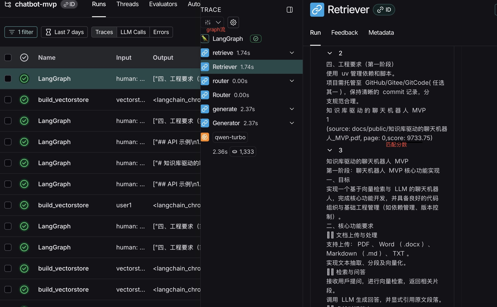

# 知识库驱动的聊天机器人 MVP

本项目实现了一个基于 **向量检索 + 大语言模型（LLM）** 的聊天机器人，支持文档知识库问答和多轮对话。
项目分两个阶段：
1. 核心功能 MVP（文档上传、检索问答、多轮对话、可观测性）
2. 工程化与部署（容器化、自动化脚本）

---

## 功能特性

- [x] 文档上传与处理（支持 PDF / Word / Markdown / TXT）
- [x] 文本抽取、分段、向量化存储
- [x] 基于向量检索的知识库问答，回答中包含原文引用
- [x] 用户知识库隔离，避免全局共享
- [x] 多轮对话（上下文跟踪、历史回顾，目前历史内容是内存持久化）
- [x] 多用户会话隔离，避免全局共享
- [x] 调用链可观测性（基于 LangSmith 或替代工具）

---

## 技术栈

- **LangChain** / **LangGraph**：对话编排与调用链管理
- **LangSmith**：调用链可观测性
- **向量库**：Chroma
- **uv**：依赖和脚本管理
- **Docker / docker-compose**

## 效果展示



---

## 本地部署步骤

1. 克隆仓库
   ```bash
   git clone https://github.com/intellectualmora/chatbot-mvp.git
   cd chatbot-mvp
2. 配置环境变量
   请在根目录.env文件
    ```ini
    DASHSCOPE_API_KEY=your_dashscope_api_key_here

3. 运行自动部署脚本
   ```bash
   bash init.sh

## Docker部署步骤

2. docker-compose 一键启动
   ```bash
    docker compose up --build

3. 停止服务
    ```bash
    docker compose down

## API 示例
1. 上传文档
    ```bash
    curl -X POST "http://127.0.0.1:7777/upload" \
     -F "user_id=user1" \
     -F "is_public=false" \
     -F "file=@/path/to/example.pdf"
2. 普通对话
    ```bash
    curl -X POST "http://localhost:7777/chat" \
    -H "Content-Type: application/json" \
    -d '{"user_id":"user1","message":"这份文档的核心目标是什么？"}'
3. 历史回顾
   ```bash
   curl -X POST "http://127.0.0.1:7777/history" \
   -H "Content-Type: application/json" \
   -d '{"user_id":"user1"}'
